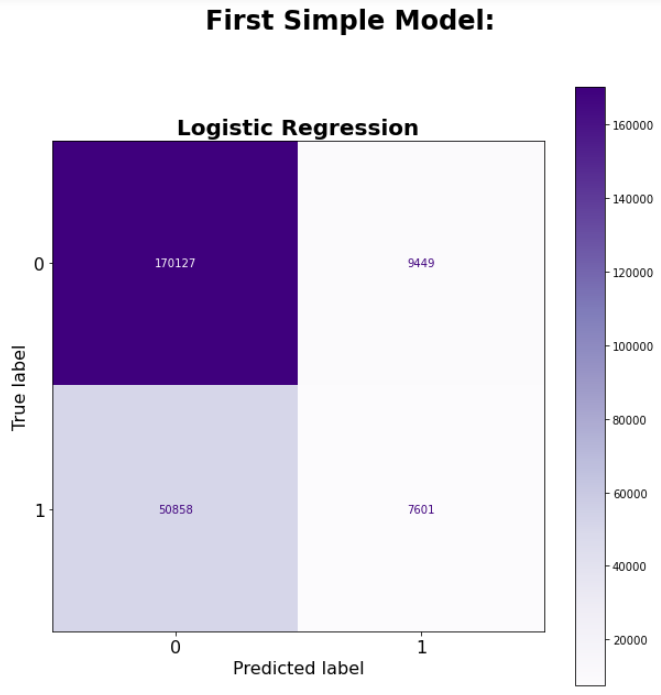
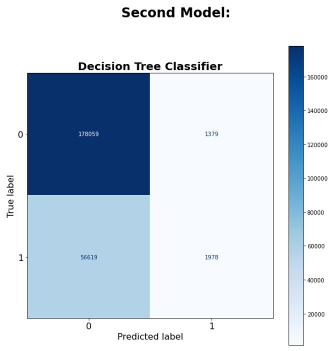
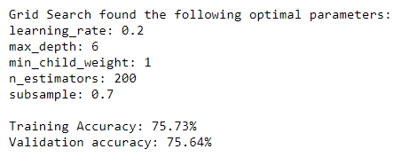
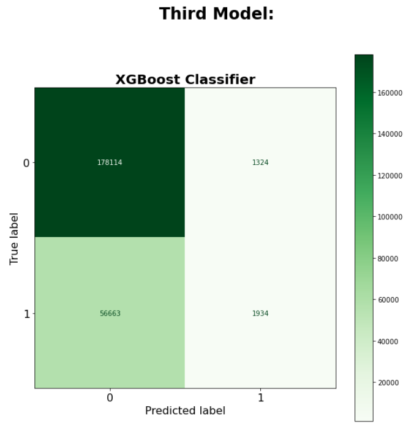
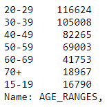

# Chicago Car Crash Project

**Authors**: [Doug Mill](mailto:thedougmill@gmail.com),
             [Michael Lee](mailto:baekho5767@gmail.com), and 
             [Carlos Mccrum](mailto:carlosmccrum@gmail.com)
 
## Overview

Our task is to build inferential classification models for the Vehicle Safety Board of Chicago. We cleaned and formatted our data provided by the City of Chicago containing crashes,  vehicles and people relating to crashes from 2016 to 2020, we then modeled the primary contributory causes of car accidents into two categories. We used an iterative modeling approach and incorporated several classification models to see if we could find what crashes were preventable. Our recommendations include investing in driver education for certain age groups and fixing certain road conditions that could cause a crash. 

## Business Understanding

Our stakeholder is the Vehicle Safety Board of Chicago. They are launching a new campaign to reduce car crashes. Our task is to build an inferential model to find out  which crashes were preventable and not. We labeled ‘Preventable’ as crashes that could have easily been avoided. Not following traffic laws and negligent driving would fall under this category. ‘Less Preventable’ are crashes that would require a substantial amount of money, time, and labor to fix. Bad road conditions, vision obscurity, and bad weather conditions would fall under this category.

## Data Understanding

The Vehicle Safety Board would like to better understand the causes of crashes in the Chicago area. That way, they can focus their campaign on potentially preventing some of those crashes in the future. We used data from the City of Chicago Data Portal, which contains information about Chicago Car Crashes from January 2016 to December 2020. The target variable was “primary contributory cause” as recorded by the police officer at the scene of the crash. Some of our inferential variables “defect road”, “bad road conditions”, and “obscured vision” will help us in our analysis to see if a crash was preventable. 

## Data Preparation

We combined 3 different datasets that we found on the City of Chicago website. Those datasets were crashes, people, and vehicles. 

Crashes details various contributory causes of the accidents such as traffic devices and road conditions. For this dataset, we dropped all unnecessary columns such as injury severity and street direction. After dropping missing values we could not reasonably populate ourselves, we were left with a dataset of ~950,000 entries. Then, we mapped all the object data types into an int or float 64 to pass into our model. Finally, we created a Target column to label the crashes as Preventable or Less Preventable.

Next, we worked on the people dataset. For the people dataset, we dropped 25 unnecessary columns that we think would not influence the primary contributory cause of an accident. We removed remaining null and unknown values. We then binned by age, and this is where we saw that most of the drivers involved in accidents were between the ages of 20-39. We then converted the remaining features into binary variables. We joined this with the crash dataset and mapped the features into our target. 

Lastly, we worked on the vehicle dataset. For this dataset, we only kept the vehicle defect and number of passengers variables. We turned these into binary variables.
Our cleaned CSV's are in [Cleaned CSVs](/data/cleaned_data/)

Our data preparation process can be found in our [Data Cleaning Notebook](/appendix/Data_Cleaning.ipynb) located in the appendix.

## Modeling

Our target had a distribution of .75 to .25. The 2 categories in the target are 0 for preventable and 1 for not preventable. Because our class balance was 3:1, we did not SMOTE the minority class.

We modeled the data through iterative modeling. We used a logistic regression model as our first simple model.  
We graded this model on accuracy score and it resulted in 0.7466465015648959. This was our lowest score. Therefore we used this as our baseline. It was something simple and understandable yet still decent and something we could build on.



For our second model, we created a Decision Tree Classifier that scored slightly better than our simple model. We used a RFE to determine the most important features and iterated with GridSearch to find the best parameters. We found bad road conditions, road defects, traffic device failure, obscured driver vision, and driver error were the most important features. We ran a decision tree with these features as well as all features.
Important features: 0.7555023420925494
All features: 0.7563467557291995
We then ran a grid search, which scored roughly the same.



Lastly, we used a XGBoost classifier with GridSearchCV to find the best model.
This model performed very similarly:




## Regression Results

The results of our model indicated that most of the crashes were Preventable. By spending more money on drivers education in ages 20-39, we could curb the total accidents in Chicago drastically. This would be an efficient and effective use of funds for the Vehicle Safety Board of Chicago.



## Conclusions

We recommend investing in an online driver and behavior education campaign because this could significantly lower the amount of preventable crashes in the Chicago area. We recommend driver education because it is affordable, easy to implement, and saves a lot more in labor costs vs. repairing all the roads in Chicago. We also suggest that the driver education campaign target a younger audience between 20-39. It would be most effective to market it to these folks as they comprised roughly 49.2% of drivers involved in crashes.

## For More Information

See the full analysis in the [Jupyter Notebook](./Chicago_Car_Crash_Notebook.ipynb) or review this [Presentation](./Chicago_Car_Crash_Presentation.pdf).

For additional info contact [Michael Lee](mailto:baekho5767@gmail.com), [Carlos Mccrum](mailto:carlosmccrum@gmail.com), and [Doug Mill](mailto:thedougmill@gmail.com).

## Repository Structure

```
├── appendix
├── data
├── images
├── .DS_Store
├── .gitattributes
├── .gitignore
├── Chicago_Car_Crash_Notebook.ipynb
├── Chicago_Car_Crash_Presentation.pdf
└── README.md
